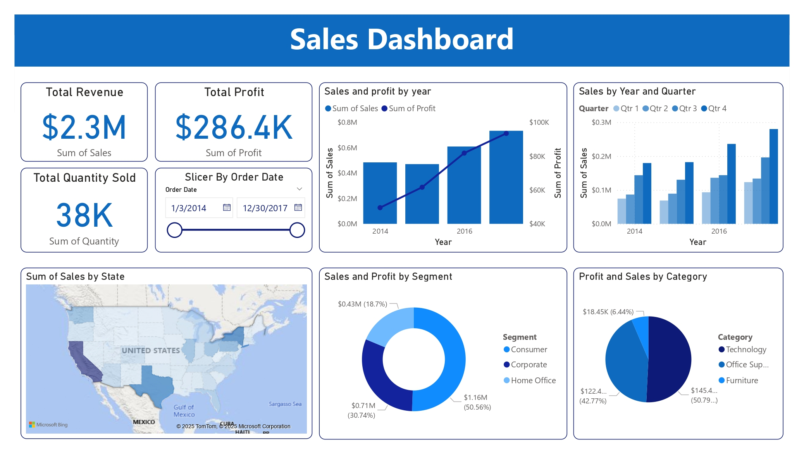
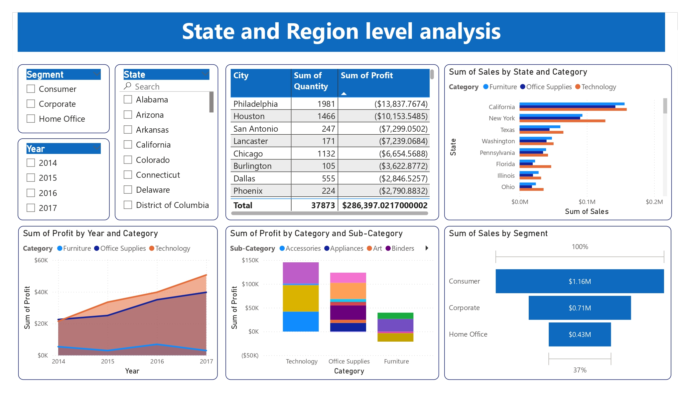
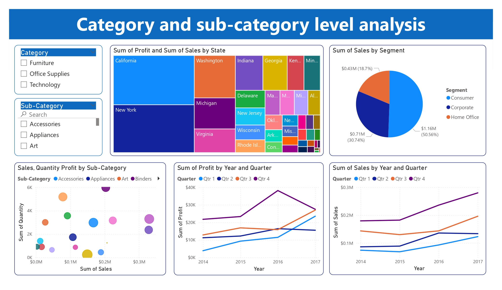

# 📊 Superstore Data Insights using Power BI

This project explores Superstore sales data and presents key insights using powerful interactive visualizations in Power BI. It covers sales trends, regional performance, and category-level analysis to assist in data-driven decision-making.

---

## 📌 Report Highlights

### 1. **Overall Sales Overview**
A summary of key performance indicators including total sales, profit, and shipping trends.

---

### 2. **State and Region Level Analysis**
Visual breakdown of sales performance by state and region to uncover geographic trends.

---

### 3. **Category & Sub-Category Performance**
Detailed insight into product categories and sub-categories to identify top-selling segments.

---

## 📁 Files Included

- `Sales report.pbix` – Power BI report file  
- `Sample - Superstore.xls` – Raw dataset  
- `/screenshots` – Folder containing report visuals  

---

## 🚀 How to Use

1. Clone the repository or download the ZIP  
2. Open `Sales report.pbix` in Power BI Desktop  
3. Refresh the data if needed and explore insights  

---

## 🛠 Tools Used

- Microsoft Power BI  
- Excel (data preprocessing)  

---

Feel free to fork this project or use the visuals as inspiration for your own dashboards!

